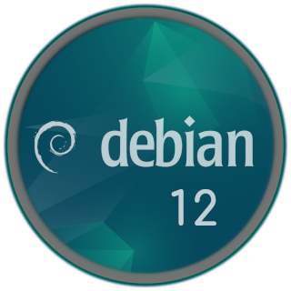

Ez a Bash szkript automatikusan beállít egy statikus IP-címet Debian 12 rendszeren, elvégzi a
rendszerfrissítést, majd telepíti a Docker-t és a docker-compose-t a beállított verzióval. 
A szkript biztonsági mentést készít a hálózati konfigurációról, színes visszajelzést ad, és
minden lépést automatikusan végrehajt root jogosultság mellett.

  

